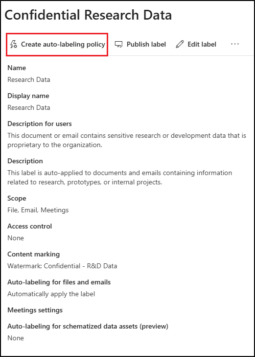

---
lab:
  task: Create and publish a sensitivity label
  exercise: Exercise 2 - Create and publish a sensitivity label
---

# Qualifikationsaufgaben

Ihre Aufgabe besteht darin, Vertraulichkeitsbezeichnungen in Ihrer Organisation zu erstellen und zu veröffentlichen, die vertrauliche Daten entsprechend ihrer Vertraulichkeitsstufe und den erforderlichen Zugriffskontrollen klassifiziert und schützt.

**Aufgaben:**

1. Aktivieren der Unterstützung für Vertraulichkeitsbezeichnungen
1. Erstellen von Vertraulichkeitsbezeichnungen
1. Veröffentlichen von Vertraulichkeitsbezeichnungen
1. Konfigurieren der automatischen Bezeichnung

## Aufgabe 1 – Aktivieren der Unterstützung für Vertraulichkeitsbezeichnungen in SharePoint und OneDrive

In dieser Aufgabe aktivieren Sie die Co-Authoring-Funktion für Vertraulichkeitsbezeichnungen, die auch Vertraulichkeitsbezeichnungen für Dateien in SharePoint und OneDrive ermöglicht.

1. Öffnen Sie **Microsoft Edge**, und navigieren Sie dann zu `https://purview.microsoft.com`.

1. Wählen Sie in der linken Navigation **Einstellungen** > **Informationsschutz**.

1. In den **Einstellungen für den Informationsschutz** stellen Sie sicher, dass Sie sich auf der Registerkarte **Co-Authoring für Dateien mit Vertraulichkeitsbezeichnungen** befinden.

1. Aktivieren Sie das Kontrollkästchen für **Ko-Authoring für Dateien mit Vertraulichkeitsbezeichnungen einschalten**.

1. Wählen Sie **Anwenden** am unteren Rand des Bildschirms.

Sie haben erfolgreich den Kundendienst für Vertraulichkeitsbezeichnungen für Dateien in SharePoint und OneDrive aktiviert.

## Aufgabe 2 – Erstellen von Vertraulichkeitsbezeichnungen

In dieser Aufgabe hat Ihre Personalabteilung eine Vertraulichkeitsbezeichnung für die Dokumente der Mitarbeitenden angefordert. Sie werden eine Vertraulichkeitsbezeichnung für interne Dokumente und eine Unterbezeichnung für die Personalabteilung erstellen.

1. Öffnen Sie **Microsoft Edge** und navigieren Sie zu **`https://purview.microsoft.com`**. Melden Sie sich bei Microsoft Purview als der Benutzende an, den Sie als **Complianceadministrator** ausgewählt haben.

1. Wählen Sie im Microsoft Purview-Portal in der linken Seitenleiste **Lösungen** und dann **Informationsschutz**.

1. Wählen Sie auf der Seite **Microsoft Information Protection** in der linken Seitenleiste **Vertraulichkeitsbezeichnungen**.

1. Auf der Seite **Vertraulichkeitsbezeichnungen** wählen Sie **+ Bezeichnung erstellen**.

1. Die Konfiguration der **Neuen Vertraulichkeitsbezeichnung** wird gestartet. Geben Sie auf der Seite **Basisdetails für diese Bezeichnung bereitstellen** ein:

    - **Name**: `Internal`
    - **Anzeigename**: `Internal`
    - **Beschreibung für Benutzende**: `Internal sensitivity label.`
    - **Beschreibung für Administratoren**: `Internal sensitivity label for Contoso.`

1. Wählen Sie **Weiter** aus.

1. Wählen Sie auf der Seite **Definieren eines Geltungsbereichs für diese Bezeichnung** die Option **Elemente** aus und wählen Sie dann **Dateien** und **E-Mails** aus. Wenn das Kontrollkästchen für **Besprechungen** aktiviert ist, stellen Sie sicher, dass es abgewählt ist.

   > [!NOTE]
   > Wenn **Besprechungen** ausgewählt ist, können Sie keine Unterbezeichnung für die Vertraulichkeitsbezeichnung erstellen.

1. Wählen Sie **Weiter** aus.

1. Wählen Sie auf der Seite **Schutzeinstellungen für gekennzeichnete Elemente festlegen** **Weiter**.

1. Wählen Sie auf der Seite **Automatische Bezeichnung für Dateien und E-Mails** **Weiter**.

1. Wählen Sie auf der Seite **Schutzeinstellungen für Gruppen und Standorte festlegen** die Option **Weiter**.

1. Wählen Sie auf der Seite **Automatische Bezeichnung für schematisierte Assets (Vorschau)** **Weiter**.

1. Wählen Sie auf der Seite **Einstellungen überprüfen und fertig stellen** die Option **Bezeichnung erstellen** aus.

1. Wählen Sie auf der Seite **Vertraulichkeitsbezeichnung** die Option **Richtlinie noch nicht erstellen** aus, und wählen Sie dann **Fertig** aus.

1. Auf der Seite **Vertraulichkeitsbezeichnungen** finden Sie die neu erstellte **Interne** Vertraulichkeitsbezeichnung. Wählen Sie die vertikalen Auslassungspunkte (**...**) daneben, dann wählen Sie **+ Unterbezeichnung erstellen** aus dem Dropdownmenü.

    

1. Der Assistent **Neue Vertraulichkeitsbezeichnung** wird gestartet. Geben Sie auf der Seite **Basisdetails für diese Bezeichnung bereitstellen** Folgendes ein:

   - **Name**: `Employee data (HR)`
   - **Anzeigename**: `Employee data (HR)`
   - **Beschreibung für Benutzende**: `This HR label is the default label for all specified documents in the HR Department.`
   - **Beschreibung für Administratoren**: `This label was created with input from the Head of HR. Contact the HR department for any changes to the label settings.`

1. Wählen Sie **Weiter** aus.

1. Wählen Sie auf der Seite **Definieren des Geltungsbereichs für diese Bezeichnung** die Option **Elemente** und dann **Dateien**, **E-Mails** und **Besprechungen** aus.

1. Wählen Sie **Weiter** aus.

1. Wählen Sie auf der Seite **Festlegen der Schutzeinstellungen für gekennzeichnete Elemente** die Option **Zugriff steuern** und wählen Sie dann **Weiter**.

1. Wählen Sie auf der Seite **Zugriffssteuerung** die Option **Konfigurieren der Einstellungen für die Zugriffssteuerung**.

1. Konfigurieren Sie die Verschlüsselungseinstellungen mit diesen Optionen:

   - **Berechtigungen jetzt zuweisen oder die Benutzenden entscheiden lassen?**: Berechtigungen jetzt zuweisen
   - **Benutzender-Zugriff auf Inhalte läuft ab**: Nie
   - **Offlinezugriff erlauben**: Nur für eine bestimmte Anzahl von Tagen
   - **Benutzende haben für so viele Tage Offlinezugriff auf den Inhalt**: 15
   - Wählen Sie den Link **Berechtigungen zuweisen**. Wählen Sie im Flyout-Bedienfeld **Berechtigungen zuweisen** die Option **+ Alle authentifizierten Benutzenden hinzufügen**, und wählen Sie dann **Speichern**, um diese Einstellung zu übernehmen.

1. Auf der Seite **Zugriffssteuerung** wählen Sie **Weiter**.

1. Wählen Sie auf der Seite **Automatische Bezeichnung für Dateien und E-Mails** **Weiter**.

1. Wählen Sie auf der Seite **Schutzeinstellungen für Gruppen und Standorte festlegen** die Option **Weiter**.

1. Wählen Sie auf der Seite **Automatische Bezeichnung für schematisierte Assets (Vorschau)** **Weiter**.

1. Wählen Sie auf der Seite **Einstellungen überprüfen und fertig stellen** die Option **Bezeichnung erstellen** aus.

1. Wählen Sie auf der Seite **Vertraulichkeitsbezeichnung** die Option **Richtlinie noch nicht erstellen** aus, und wählen Sie dann **Fertig** aus.

Sie haben erfolgreich eine Vertraulichkeitsbezeichnung für die internen Richtlinien Ihrer Organisation und eine Unterbezeichnung für die Personalabteilung (HR) erstellt.

## Aufgabe 3 – Veröffentlichen von Vertraulichkeitsbezeichnungen

Sie veröffentlichen nun die Vertraulichkeitsbezeichnungen von Intern und HR, so dass die veröffentlichten Vertraulichkeitsbezeichnungen für die Benutzenden in der Personalabteilung zur Anwendung auf ihre HR-Dokumente verfügbar sind.

1. In **Microsoft Edge** sollte die Registerkarte des Microsoft Purview-Portals noch geöffnet sein. Falls nicht, navigieren Sie zu **`https://purview.microsoft.com`** > **Lösungen** > **Informationsschutz** > **Vertraulichkeitsbezeichnungen**.

1. Auf der Seite **Vertraulichkeitsbezeichnungen** wählen Sie **Bezeichnungen veröffentlichen**.

1. Die Konfiguration der Veröffentlichung von Vertraulichkeitsbezeichnungen wird gestartet.

1. Wählen Sie auf der Seite **Wählen Sie die zu veröffentlichenden Vertraulichkeitsbezeichnungen** den Link **Wählen Sie die zu veröffentlichenden Vertraulichkeitsbezeichnungen**.

1. Aktivieren Sie im Flyout-Bedienfeld **Vertraulichkeitsbezeichnungen zum Veröffentlichen** die Kontrollkästchen **Intern** und **Daten von Intern/Mitarbeitenden (HR)** und wählen Sie dann **Hinzufügen** am unteren Rand des Flyout-Bedienfelds.

1. Zurück auf der Seite **Wählen Sie die zu veröffentlichenden Vertraulichkeitsbezeichnungen aus**, wählen Sie **Weiter**.

1. Wählen Sie auf der Seite **Admineinheiten zuweisen** **Weiter**

1. Wählen Sie auf der Seite **Veröffentlichen für Benutzer und Gruppen** die Option **Weiter**.

1. Wählen Sie auf der Seite **Richtlinieneinstellungen** **Weiter**.

1. Wählen Sie auf der Seite **Standardeinstellungen für Dokumente** die Option **Weiter**.

1. Wählen Sie auf der Seite **Standardeinstellungen für E-Mails** **Weiter**.

1. Wählen Sie auf der Seite **Standardeinstellungen für Besprechungen und Kalenderereignisse** die Option **Weiter**.

1. Wählen Sie auf der Seite **Standardeinstellungen für Fabric- und Power BI-Inhalte** die Option **Weiter**.

1. Auf der Seite **Benennen Sie Ihre Richtlinie**, geben Sie ein:

   - **Name**: `Internal HR employee data`
   - **Geben Sie eine Beschreibung für Ihre Vertraulichkeitsbezeichnungsrichtlinie** ein: `This HR label is to be applied to internal HR employee data.`

1. Wählen Sie **Weiter** aus.

1. Auf der Seite **Überprüfen und beenden** wählen Sie **Absenden**.

1. Wählen Sie auf der Seite **Neue Richtlinie erstellt** die Option **Erledigt**, um die Veröffentlichung der Richtlinie für die Bezeichnung zu beenden.

Sie haben die Vertraulichkeitsbezeichnungen „Intern“ und „HR“ erfolgreich veröffentlicht. Beachten Sie, dass es bis zu 24 Stunden dauern kann, bis die Änderungen auf alle Benutzende und Dienste übertragen sind.

## Aufgabe 4 – Erstellen einer Richtlinie zur automatischen Bezeichnung auf der Client-Seite

In dieser Aufgabe erstellen Sie eine Richtlinie für die Automatische Bezeichnung auf der Client-Seite. Client-seitige automatische Bezeichnungen werden automatisch auf Dateien und E-Mails auf der Grundlage ihres Inhalts angewendet, um sicherzustellen, dass sensible Informationen klassifiziert und geschützt werden, bevor sie das Gerät des Benutzenden verlassen.

1. Sie sollten sich immer noch auf der Seite **Vertraulichkeitsbezeichnungen** im Microsoft Purview-Portal befinden. Falls nicht, navigieren Sie zu **`https://purview.microsoft.com`** > **Lösungen** > **Informationsschutz** > **Vertraulichkeitsbezeichnungen**.

1. Auf der Seite **Vertraulichkeitsbezeichnungen** finden Sie die neu erstellte **Interne** Vertraulichkeitsbezeichnung. Wählen Sie die vertikalen Auslassungspunkte (**...**) daneben, dann wählen Sie **+ Unterbezeichnung erstellen** aus dem Dropdownmenü.

1. Die Konfiguration der **Neuen Vertraulichkeitsbezeichnung** wird gestartet. Geben Sie auf der Seite **Basisdetails für diese Bezeichnung bereitstellen** Folgendes ein:

   - **Name**: `Confidential Research Data`
   - **Anzeigename**: `Confidential Research Data`
   - **Beschreibung für Benutzende**: `This document or email contains sensitive research or development data that is proprietary to the organization.`
   - **Beschreibung für Administratoren**: `This label is auto-applied to documents and emails containing information related to research, prototypes, or internal projects.`

1. Wählen Sie **Weiter** aus.

1. Wählen Sie auf der Seite **Definieren des Geltungsbereichs für diese Bezeichnung** die Option **Elemente** und dann **Dateien**, **E-Mails** und **Besprechungen** aus.

1. Wählen Sie **Weiter** aus.

1. Wählen Sie auf der Seite **Schutzeinstellungen für bezeichnete Elemente festlegen** die Option **Inhaltsmarkierung anwenden** und wählen Sie dann **Weiter**.

1. Wählen Sie **Weiter** aus.

1. Aktivieren Sie auf der Seite **Inhaltsmarkierung** den Schalter, um die Inhaltsmarkierung zu aktivieren.

1. Wenn das Kontrollkästchen **Fußzeile hinzufügen** aktiviert ist, deaktivieren Sie es, und aktivieren Sie das Kontrollkästchen **Wasserzeichen hinzufügen**, dann wählen Sie **Text anpassen**.

1. Im Flyout-Bereich **Wasserzeichentext anpassen** geben Sie `Confidential - R&D Data` als **Wasserzeichentext** ein. Erhöhen Sie die **Schriftgröße** auf `40` und wählen Sie dann **Speichern** am unteren Rand des Bedienfelds.

1. Wenn auf der Seite **Inhaltsmarkierung** andere Optionen für die Inhaltsmarkierung aktiviert sind, deaktivieren Sie diese, um sicherzustellen, dass **Wasserzeichen hinzufügen** die einzige aktivierte Option ist.

1. Wählen Sie **Weiter** aus.

1. Auf der Seite **Automatische Bezeichnungen für Dateien und E-Mails** legen Sie die **Automatische Bezeichnungen für Dateien und E-Mails** auf „aktiviert" fest.

1. Wählen Sie im Abschnitt **Inhalt erkennen, der diesen Bedingungen entspricht** die Option **+ Bedingung hinzufügen** > **Inhalt enthält**.

1. Im Abschnitt **Inhalt enthält** wählen Sie die Option **Hinzufügen** > **Trainierbare Klassifizierer**.

1. Im Flyout-Bedienfeld **Trainierbare Klassifizierer** fügen Sie diese trainierbaren Klassifizierer hinzu:

   - `Source code`
   - `Project documents`
   - `Software Product Development Files`

1. Wählen Sie **Hinzufügen** am unteren Rand des Bedienfelds, um diese trainierbaren Klassifizierer hinzuzufügen.

1. Zurück auf der Seite **Automatische Bezeichnung für Dateien und E-Mails**, wählen Sie **Weiter**.

1. Wählen Sie auf der Seite **Schutzeinstellungen für Gruppen und Standorte festlegen** die Option **Weiter**.

1. Wählen Sie auf der Seite **Automatische Bezeichnung für schematisierte Assets (Vorschau)** **Weiter**.

1. Wählen Sie auf der Seite **Einstellungen überprüfen und fertig stellen** die Option **Bezeichnung erstellen** aus.

1. Wählen Sie auf der Seite **Ihre Vertraulichkeitsbezeichnung wurde erstellt** die Option **Bezeichnung in den Apps der Benutzenden veröffentlichen** und wählen Sie dann **Erledigt**.

1. Wählen Sie im Flyout-Bedienfeld **Bezeichnung veröffentlichen** die Option **Neue Bezeichnungsrichtlinie erstellen** aus.

1. Wählen Sie auf der Seite **Wählen Sie die zu veröffentlichenden Vertraulichkeitsbezeichnungen** den Link **Wählen Sie die zu veröffentlichenden Vertraulichkeitsbezeichnungen**.

1. Wählen Sie die übergeordnete Bezeichnung **Intern** und die soeben erstellte Bezeichnung **Vertrauliche Forschungsdaten**, und wählen Sie dann **Hinzufügen**.

1. Zurück auf der Seite **Wählen Sie die zu veröffentlichenden Vertraulichkeitsbezeichnungen aus**, wählen Sie **Weiter**.

1. Wählen Sie auf der Seite **Admineinheiten zuweisen** **Weiter**.

1. Wählen Sie auf der Seite **Veröffentlichen für Benutzer und Gruppen** die Option **Weiter**.

1. Aktivieren Sie auf der Seite **Richtlinieneinstellungen** das Kontrollkästchen für **Benutzende müssen eine Begründung bereitstellen, um eine Bezeichnung zu entfernen oder ihre Klassifizierung herabzusetzen** und wählen Sie dann **Weiter** aus.

1. Wählen Sie auf der Seite **Standardeinstellungen für Dokumente** die Option **Weiter** aus, bis Sie die Seite **Benennen Sie Ihre Richtlinie** erreichen.

1. Auf der Seite **Benennen Sie Ihre Richtlinie**, geben Sie ein:

   - **Name**: `R&D Confidential Data Policy`
   - **Geben Sie eine Beschreibung für Ihre Vertraulichkeitsbezeichnungsrichtlinie** ein: `Automatically applies labels to source code, project documents, and development files to protect sensitive R&D data.`

1. Wählen Sie **Weiter** aus.

1. Auf der Seite **Überprüfen und beenden** wählen Sie **Absenden**.

1. Wählen Sie auf der Seite **Neue Richtlinie erstellt** die Option **Fertig** aus.

Sie haben erfolgreich eine clientseitige Richtlinie zur automatischen Bezeichnung erstellt, die automatisch die Bezeichnung **Vertrauliche Forschungsdaten** auf Dateien und E-Mails anwendet, die Forschungs- und Entwicklungsdaten enthalten. Es kann bis zu 24 Stunden dauern, bis die Richtlinie vollständig in Kraft tritt.

## Aufgabe 5 – Erstellen einer Richtlinie zur automatischen Bezeichnung auf der Dienstseite

In dieser Aufgabe erstellen Sie eine Richtlinie für automatische Bezeichnungen auf der Dienstseite. Automatische Bezeichnungen werden von Cloud-Diensten wie SharePoint, Exchange und OneDrive nach dem Hochladen oder Empfangen von Inhalten angewendet, um sicherzustellen, dass sensible Daten auch dann geschützt sind, wenn Benutzende sie nicht manuell klassifizieren.

1. Sie sollten sich immer noch auf der Seite **Vertraulichkeitsbezeichnungen** im Microsoft Purview-Portal befinden. Falls nicht, navigieren Sie zu **`https://purview.microsoft.com`** > **Lösungen** > **Informationsschutz** > **Vertraulichkeitsbezeichnungen**.

1. Erweitern Sie die Bezeichnung **Intern** und wählen Sie dann die Unterbezeichnung `Confidential Research Data`, die Sie in einer früheren Aufgabe erstellt haben.

1. Im Flyout-Bedienfeld **Vertrauliche Forschungsdaten** sehen Sie die Eigenschaften für die automatische Bezeichnung, die Sie in einer früheren Aufgabe erstellt haben. Wählen Sie in diesem Bedienfeld die Option **Richtlinie für die automatischen Bezeichnung erstellen**.

    

1. Auf der Seite **Benennen Sie Ihre Richtlinie**, geben Sie ein:

   - **Name**: `R&D Confidential Data Container Policy`
   - **Geben Sie eine Beschreibung für Ihre Vertraulichkeitsbezeichnungsrichtlinie** ein: `Automatically applies the Confidential Research Data label to content in SharePoint, Exchange, and OneDrive.`

1. Wählen Sie **Weiter** aus.

1. Wählen Sie auf der Seite **Admineinheiten zuweisen** **Weiter**.

1. Lassen Sie auf der Seite **Wählen Sie Speicherorte aus, auf die Sie die Bezeichnung anwenden möchten** die Optionen **Exchange E-Mail**, **SharePoint-Webseiten** und **OneDrive-Konten** ausgewählt, und wählen Sie dann **Weiter**.

1. Lassen Sie auf der Seite **Gemeinsame oder erweiterte Regeln einrichten** die Option **Gemeinsame Regeln** ausgewählt und wählen Sie dann **Weiter**.

1. Bearbeiten Sie auf der Seite **Regeln für Inhalte an allen Speicherorten definieren** die Regel **Vertrauliche Forschungsdaten**.

    

1. Im Flyout-Bedienfeld **Neue Regel** wählen Sie unter **Bedingungen** > **Inhalt enthält** das Dropdown-Menü für **Hinzufügen**, dann wählen Sie **Trainierbare Klassifizierer**.

1. Im Flyout-Bedienfeld **Trainierbare Klassifizierer** fügen Sie diese trainierbaren Klassifizierer hinzu:

   - `Source code`
   - `Project documents`
   - `Software Product Development Files`

   Dies gewährleistet einen konsistenten Schutz zwischen client- und dienstseitigen Bezeichnungen.

1. Wählen Sie **Hinzufügen** am unteren Rand des Bedienfelds, um diese trainierbaren Klassifizierer hinzuzufügen.

1. Zurück auf der Seite **Regeln für Inhalte an allen Speicherorten festlegen**, wählen Sie **Weiter**.

1. Auf der Seite **Wählen Sie eine Bezeichnung, die automatisch angewendet werden soll**, lassen Sie die Option **Interne/Vertrauliche Forschungsdaten** ausgewählt und wählen dann **Weiter**.

1. Wählen Sie auf der Seite **Entscheiden Sie, ob Sie die Richtlinie jetzt oder später testen möchten** die Option **Richtlinie im Simulationsmodus ausführen** und aktivieren Sie das Kontrollkästchen für **Richtlinie automatisch einschalten, wenn sie nach 7 Tagen in der Simulation nicht geändert wurde**, und wählen Sie dann **Weiter** aus.

1. Auf der Seite **Überprüfen und beenden** wählen Sie **Richtlinie erstellen**.

1. Wählen Sie auf der Seite Ihre **Richtlinie für die automatische Bezeichnung wurde erstellt** die Option **Fertig**.

Sie haben erfolgreich eine Richtlinie zur automatischen Bezeichnung auf der Dienstseite erstellt, die automatisch die Bezeichnung **Vertrauliche Forschungsdaten** auf in SharePoint, Exchange und OneDrive gespeicherte oder freigegebene Inhalte anwendet. Es kann bis zu 24 Stunden dauern, bis die Richtlinie in Kraft tritt.
